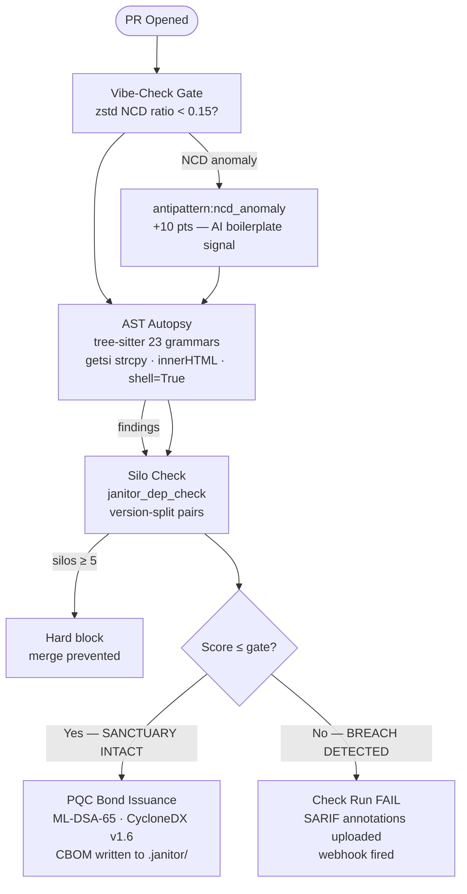

# SOVEREIGN BRIEFING — THE JANITOR ENGINE

> **Canonical state document.** Generated by direct source audit. All values
> derive from code, not prior documentation. Supersedes all predecessor files.

---

## I. CORE PRIMITIVES

### Runtime Language Infrastructure

| Grammar | `polyglot` Static | Extension(s) |
|---|---|---|
| Rust | `RUST` | `rs` |
| Python | `PYTHON` | `py` |
| JavaScript | `JAVASCRIPT` | `js`, `jsx` |
| TypeScript | `TYPESCRIPT` | `ts`, `tsx` |
| C++ | `CPP` | `cpp`, `cxx`, `cc`, `hpp` |
| C | `C` | `c`, `h` |
| Java | `JAVA` | `java` |
| C# | `CSHARP` | `cs` |
| Go | `GO` | `go` |
| GLSL | `GLSL` | `glsl`, `vert`, `frag` |
| Objective-C | `OBJC` | `m`, `mm` |
| YAML | `YAML` | `yaml`, `yml` |
| Bash | `BASH` | `sh`, `bash` |
| Scala | `SCALA` | `scala` |
| Ruby | `RUBY` | `rb` |
| PHP | `PHP` | `php` |
| Swift | `SWIFT` | `swift` |
| Lua | `LUA` | `lua` |
| HCL/Terraform | `HCL` | `tf`, `hcl` |
| Nix | `NIX` | `nix` |
| GDScript | `GDSCRIPT` | `gd` |
| Kotlin | `KOTLIN` | `kt`, `kts` |

**23 grammars total.** Each grammar is a `OnceLock<Language>` static — loaded once on first use, zero per-call allocation thereafter.

**Active AST security rules**: 23/23 grammars (100%) have dedicated `find_<lang>_slop` or
`find_<lang>_danger_nodes` AST walks in `crates/forge/src/slop_hunter.rs` (v8.8.0).
Phase 7 completed full grammar coverage: Rust (unsafe transmute + raw ptr deref), GLSL
(dangerous extension byte scan), HCL/Terraform (data external + local-exec provisioner
AST walk), and TSX/JSX (dangerouslySetInnerHTML attribute walk).

**Active offensive expansion lanes**: Live-Tenant AEG HTML Harness Generation,
GraphQL/AsyncAPI Trust Boundary Extraction, and Web3 EVM Invariant Checking are
first-class enforcement surfaces, not roadmap placeholders.

Grammar library: `tree-sitter 0.26` (workspace pinned).

### Foundational Crates & Mathematical Models

| Primitive | Crate / Constant | Purpose |
|---|---|---|
| Fuzzy clone detection | `AstSimHasher` — SimHash over `(kind_id u16, depth u32)` feature pairs | Detects structural refactors without textual identity |
| Swarm clustering | `LshIndex` — MinHash, 8 bands × 8 rows, 64-hash sketch | O(1) amortised PR → clone-cluster lookup |
| Patch entropy gate | `check_entropy` — `zstd::encode_all` level 3, ratio = `compressed/raw` | NCD verbosity detection |
| Byte lattice shield | `ByteLatticeAnalyzer` — windowed Shannon entropy, 512-byte window, 256-byte stride | Binary/generated blob detection |
| Compiled payload scanner | `binary_hunter` — AhoCorasick over 7 static byte patterns | ELF/PE/WASM/miner injection detection |
| Merge simulation | `simulate_merge` via `libgit2` — `diff.foreach` + `RefCell` patch accumulation | Zero disk checkout; O(PR-diff) memory |
| Symbol persistence | `rkyv 0.8` — zero-copy archive format | IPC registry at `.janitor/symbols.rkyv` |
| Hot-swap registry | `arc_swap::ArcSwap<SymbolRegistry>` | Lock-free atomic reload without daemon downtime |
| Memory backpressure | `Physarum` — `sysinfo 0.30`, threshold model | System-aware concurrency gate; prevents OOM |
| Dependency graph | `petgraph 0.7` — transitive compile-time reach analysis | C++ silo detection in `Structural Topology` tab |
| Pattern matching | `aho_corasick 1.1` — single automaton per pattern group (`OnceLock`) | Hot-path multi-pattern search without recompilation |
| Hashing | `blake3 1.5` — exact structural hash per function body | Zombie/clone identity |
| Security — Dual-PQC | ML-DSA-65 (FIPS 204) + SLH-DSA-SHAKE-192s (FIPS 205) — PRODUCTION. Dual-PQC key bundles (4128 bytes) generated via `janitor generate-keys`. The Governor signs every CycloneDX v1.6 CBOM bond with both algorithms. `pqc_enforced: true` in `janitor.toml` blocks PR merge if bond issuance fails. | Post-quantum attestation for CycloneDX v1.6 CBOM bonds |
| Security — Ed25519 | `vault::SigningOracle::verify_token` — public-key-only; no private key in binary | API token gate for `janitor_clean` (MCP) and `/v1/attest` |

---

## II. POLICY LAYER

`janitor.toml` at the repository root encodes maintainer-controlled slop tolerance as
version-controlled, reviewable configuration. Loaded by `JanitorPolicy::load()` in
`crates/common/src/policy.rs`. Full field reference: [Setup → janitor.toml Reference](setup.md).

| Field | Default | Purpose |
|---|---|---|
| `min_slop_score` | 100 | Gate threshold — raw score ceiling |
| `require_issue_link` | false | Block PRs with no `#N` reference |
| `allowed_zombies` | false | Downgrade zombie veto to warning |
| `pqc_enforced` | false | Block PR when ML-DSA-65 bond fails (needs Sentinel) |
| `refactor_bonus` | 0 | Raise gate for `[REFACTOR]`/`[FIXES-DEBT]` PRs |
| `custom_antipatterns` | [] | Project-specific `.scm` query files |
| `trusted_bot_authors` | [] | Handles exempt from unlinked-PR penalty |
| `[forge].automation_accounts` | [] | Ecosystem accounts without `[bot]` suffix |

---

## III. EXECUTION PIPELINE — HYPER-GAUNTLET

Entry point: `tools/gauntlet-runner` binary, invoked via `just hyper-gauntlet` or `just run-gauntlet`.

### Stage 0 — Pre-emptive Workspace Purge

```
For each target repo (non-resume mode):
  rm -rf <gauntlet_dir>/<owner>/<repo>
  # Clean slate: no stale bounce_log.ndjson bleeds into aggregate

Resume mode (--resume):
  Save <repo>/.janitor/bounce_log.ndjson → memory buffer
  Perform clone/fetch below
  Restore buffer → <repo>/.janitor/bounce_log.ndjson
```

### Stage 1 — Repository Hydration

**Hyper-drive mode** (`--hyper`, default for `just hyper-gauntlet`):

```bash
git clone --no-checkout https://github.com/<owner>/<repo>.git <repo_dir>
git -C <repo_dir> fetch origin 'refs/pull/*/head:refs/remotes/origin/pr/*'
```

Zero `gh pr diff` subshells. All PR refs land in the packfile.

**Parallel-bounce mode** (default for `just run-gauntlet`):

```
gh pr list --json number,author,mergeable,state --limit <PR_LIMIT>
Filter: exclude CONFLICTING, exclude Bot authors
For each open PR (rayon pool sized by `detect_optimal_concurrency()`, GIT_LOCK mutex):
  gh pr diff <N> --repo <slug>   → diff text
  janitor bounce <repo_dir> --patch <diff> --pr-number <N> --author <A> --format json
```

### Stage 2 — In-Memory Merge Simulation (Hyper-drive)

```
janitor hyper-drive <repo_dir> --pr-limit <N> --timeout <S>s
  → build_symbols_rkyv(repo_path, base_sha)    [git_drive.rs — Necrotic Hydration]
  → For each PR ref:
      simulate_merge(repo, base_oid, pr_head_oid) → MergeSnapshot {
          blobs:   HashMap<PathBuf, Vec<u8>>    // Full HEAD blob per file
          patches: HashMap<PathBuf, String>     // Actual unified diff per file
          deleted: Vec<PathBuf>
          total_bytes: usize
      }
      Routing:
        snapshot.blobs   → IncludeGraphBuilder + SemanticNull
        snapshot.patches → PatchBouncer (SlopHunter, AstSimHasher, NCD)
      iter_by_priority() feeds high-SLOP-vector extensions first (Chemotaxis):
        "rs","py","go","js","ts","tsx","jsx","cs","java","cpp","cc","cxx","c"
```

### Stage 3 — PatchBouncer Per-File (sequence within `bounce()`)

```
1. Language detection          lang_for_ext() from "+++ b/<path>" header
2. Circuit breaker             patch > 1 MiB → skip
3. IAC bypass                  ext in IAC_TEXT_EXTS → skip ByteLatticeAnalyzer
4. Binary asset bypass         ext in BINARY_ASSET_EXTS → skip ByteLatticeAnalyzer
5. ByteLatticeAnalyzer         AnomalousBlob? → antipattern:agnostic_shield_anomaly
6. Extract added lines         "+"-prefixed diff lines only
7. Tree-sitter parse           grammar for lang; ERROR/MISSING nodes → neutral score
8. Structural hashing          BLAKE3 exact + SimHash fuzzy per function/method
9. Logic clone detection       Hamming(a, b) ≤ 3 → Refactor; 4–9 → Zombie
10. find_slop(lang, source)    Language-specific AST antipatterns (see Threat Matrix)
11. check_entropy(patch_bytes) NCD verbosity gate (zstd ratio < 0.05)
12. binary_hunter::scan()      AhoCorasick 7-pattern compiled payload scan
13. CommentScanner             Banned-phrase detection in added comment nodes
14. is_pr_unlinked(pr_body)    No linked issue → +20 pts
15. Collider lookup            LshIndex.query(PrDeltaSignature) → collided_pr_numbers
16. Necrotic Hydration check   backlog_pruner verdict → necrotic_flag
```

### Stage 4 — Bounce Log Persistence

Each PR result appended to `<repo_dir>/.janitor/bounce_log.ndjson` via `append_bounce_log()`.
`f.sync_all()` called after every write — survives SIGKILL.

### Stage 5 — Global Aggregation (post all repos)

Two threads spawned in parallel after sequential repo processing:

```
Thread A: janitor report --global --format pdf  → <gauntlet_dir>/global_report.pdf
Thread B: janitor export --global               → <gauntlet_dir>/export.csv
```

---

## IV. THE THREAT MATRIX

All threats detected by `PatchBouncer::bounce()` in `crates/forge/src/slop_filter.rs`.

### Tier 1 — Critical Threats (`security:` prefix → $150/intercept)

| ID | Detector | Condition | Points |
|---|---|---|---|
| `security:compiled_payload_anomaly` | `binary_hunter` | ELF magic `\x7fELF`, WASM `\x00asm\x01\x00\x00\x00`, PE `MZ\x90\x00\x03`, `/bin/sh\x00`, `cmd.exe\x00`, `stratum+tcp://`, `stratum2+tcp://` | +50 per match |
| `security:signature_replay` | `solidity_taint` | Solidity `ecrecover` flow lacks nonce consumption or `block.chainid` domain separation | +50 per match |
| `security:unsafe_delegatecall` | `solidity_taint` | Solidity `delegatecall` target is derived from caller-controlled input without an owner/role guard | +50 per match |
| Swarm Collision | `LshIndex` | `collided_pr_numbers` non-empty | Categorical → $150 billing |

### Tier 2 — Architectural Antipatterns (AST-derived)

Detected by `find_slop(lang, source)` in `crates/forge/src/slop_hunter.rs`:

| Language | Pattern | Severity | Points |
|---|---|---|---|
| YAML | `VirtualService`/`Ingress`/`HTTPRoute`/`Gateway` with `hosts: ["*"]` | Critical | 50 |
| C | `gets()` call (removed in C11; unbounded buffer overflow) | Critical | 50 |
| HCL/Terraform | Open CIDR `0.0.0.0/0` in ingress rule | Critical | 50 |

### Tier 3 — NCD Verbosity (`antipattern:` prefix → Warning tier)

| ID | Detector | Condition | Points |
|---|---|---|---|
| `antipattern:ncd_anomaly` | `check_entropy` | `compressed/raw < 0.05` AND patch ≥ 256 bytes | 10 |

**Critical distinction**: `antipattern:` prefix — NOT `security:`. `is_critical_threat()` gates on `"security:"`. NCD intentionally uses `antipattern:` to avoid $150 categorical billing.

### Tier 4 — Structural Quality

| Detector | Condition | Score Effect |
|---|---|---|
| Logic clone detection | Hamming ≤ 3 (Refactor-class similarity) | +5 per clone pair (capped at 50 pairs) |
| Zombie symbols | Dead body hash matches symbol in registry | +10 per zombie |
| Comment violations | Banned phrase in added comment | +5 per violation |
| Unlinked PR | No issue reference in PR body | +20 |
| Hallucinated security fix | Security keywords, non-code-only diff | +100 |

### Bypass Rules

| Condition | Effect |
|---|---|
| `ext in IAC_TEXT_EXTS` (`nix lock json toml yaml yml csv`) | Skip `ByteLatticeAnalyzer` |
| `ext in BINARY_ASSET_EXTS` (`wasm woff woff2 eot ttf png jpg jpeg gif ico zip gz tar pdf`) | Skip `ByteLatticeAnalyzer` |
| patch > 1 MiB | Skip entire file |
| Nix entities | `Protection::WisdomRule` — all symbols shielded from dead-code classification |
| Bot author (`app/` prefix, `[bot]` suffix, trusted list, `forge.automation_accounts`) | Score still computed; billing classification unchanged |

---

## V. THE ACTUARIAL LEDGER

### Classification Function (`crates/cli/src/report.rs`)

```rust
pub fn is_critical_threat(e: &BounceLogEntry) -> bool {
    e.antipatterns.iter().any(|a| a.contains("security:"))
        || !e.collided_pr_numbers.is_empty()
}
```

### Billing Tiers

| Classification | Condition | Rate |
|---|---|---|
| **Critical Threat** | `is_critical_threat(e) == true` | $150 per intercept |
| **GC-only Necrotic** | `necrotic_flag.is_some()` OR `!zombie_deps.is_empty()` AND NOT critical | $20 per intercept |
| **StructuralSlop** | `slop_score > 0` AND NOT critical AND NOT necrotic | $20 per intercept |
| **Boilerplate** | `slop_score == 0`, no threat signal | $0 |

### Score Formula (`SlopScore::score()`)

```
score = (logic_clones_found.min(50) × 5)
      + (zombie_symbols_added × 10)
      + (antipattern_score.min(500))      ← sum of Severity::points() per finding
      + (comment_violations × 5)
      + (unlinked_pr × 20)
      + (hallucinated_security_fix × 100)
```

`dead_symbols_added` is tracked but **excluded from score()** (v7.6.2 — FFI false-positive elimination).

### Total Economic Impact (TEI)

```
critical_threats_count    = entries where is_critical_threat()
gc_only_count             = entries where necrotic_flag.is_some() AND NOT is_critical_threat()
structural_slop_count     = entries where slop_score > 0 AND NOT critical AND NOT necrotic
total_actionable_intercepts = critical_threats_count + gc_only_count + structural_slop_count

critical_threat_bounty_usd = critical_threats_count × $150
gc_value_usd               = gc_only_count × $20
structural_slop_usd        = structural_slop_count × $20
total_economic_impact      = critical_threat_bounty_usd + gc_value_usd + structural_slop_usd
total_ci_energy_saved_kwh  = sum(ci_energy_saved_kwh per entry)   # configurable via [billing] ci_kwh_per_run
```

### CSV Column Schema (16 columns, exact order)

```
 1. PR_Number
 2. Author
 3. Score
 4. Threat_Class          "Critical" | "Necrotic" | "StructuralSlop" | "Boilerplate"
 5. Unlinked_PR
 6. Logic_Clones
 7. Antipattern_IDs       pipe-delimited rule labels (e.g. security:compiled_payload_anomaly|antipattern:ncd_anomaly)
 8. Collided_PRs          pipe-delimited collided PR numbers; empty if none
 9. Time_Saved_Hours      necrotic_count × triage_minutes_per_finding ÷ 60 (default 12 min; configurable via [billing] in janitor.toml)
10. Operational_Savings_USD ($150 critical / $20 GC-only / $0 otherwise; rates configurable via [billing] in janitor.toml)
11. Timestamp
12. PR_State
13. Is_Bot
14. Repo_Slug
15. Commit_SHA            Git SHA of the PR head at bounce time; from --head or GITHUB_SHA; empty when unavailable
16. Policy_Hash           BLAKE3 hex digest of janitor.toml at bounce time; empty when no manifest present (SOC 2 audit trail)
```

**`[billing]` TOML table** (override actuarial defaults):
```toml
[billing]
triage_minutes_per_finding = 12.0   # senior-engineer minutes per finding (Workslop 2026 default)
critical_threat_usd        = 150.0  # billing rate for Critical Threats
necrotic_usd               = 20.0   # billing rate for Necrotic GC flags
```

**`[webhook]` TOML table** (SIEM / Slack / Teams integration):
```toml
[webhook]
url    = "https://hooks.slack.com/services/..."
secret = "env:JANITOR_WEBHOOK_SECRET"   # or literal string for dev
events = ["critical_threat"]            # "critical_threat" | "necrotic_flag" | "all"
```

### PDF Report Structure

#### Global Report (`render_global_markdown`)

| Page | Content |
|---|---|
| 1 — Executive Summary | Timestamp, repo count, PR count; Critical Threats / Necrotic GC / TEI table; methodology footnote |
| 2 — Threat Distribution | ASCII bar chart — one line per repo, `█` Critical, `░` Necrotic |
| 3 — Repository Breakdown | Table: Repository / PRs / Total Slop / Intercepts / Economic Impact / Worst PR |
| 4 — Top 10 Riskiest PRs | Cross-repo PRs with score > 50, ranked descending |
| — Scoring Methodology | Billing-tier table + score formula |
| — Appendix: Full Audit Log | Per-repo `\newpage` sections: metric table, Top 10 Sloppiest PRs, Top 10 Cleanest Contributors, C/C++ compile-time silos |

#### Single-Repo Report (`render_markdown`)

| Section | Content |
|---|---|
| Executive Summary | Workslop metric table (actionable intercepts, critical, GC, hours, TEI) |
| *(page break)* | |
| Scoring Methodology | Billing-tier table + score formula |
| Top 10 High-Risk PRs | Table + antipattern detail expansion |
| Necrotic PRs | Backlog Pruner GC flags |
| Structural Clones | MinHash clone pairs |
| Zombie Dependencies | Manifest scan results |
| Full PR Log | Every PR scored > 0 |

---

## VI. THE COMMAND & CONTROL INTERFACE

Invoked via: `janitor dashboard`
Crate: `crates/dashboard`

### Mode 1 — TargetSelection

Scans `<gauntlet_dir>` for cloned repositories. Displays them as a navigable list.
Repositories with `bounce_log.ndjson` modified within the last **10 seconds** are tagged `[ AUDIT ACTIVE ]` (blinking).
List rescans automatically every **2 seconds**.

**Key Bindings:**

| Key | Action |
|---|---|
| `↑` / `↓` | Navigate repository list |
| `Enter` | Open repository in ActiveSurveillance mode |
| `q` | Quit |

### Mode 2 — ActiveSurveillance (per-repo)

Full-screen view. Layout: title bar (3 rows) → tab selector (3 rows) → content (fill) → footer (1 row).
Log file polled for changes every **2 seconds**.

**Three tabs:**

| Tab | Index | Content |
|---|---|---|
| **Live Telemetry** | 0 | PR delta feed: score, necrotic flag, clone count, antipattern detail strings, collided PR numbers |
| **Structural Topology** | 1 | Top-10 C++ compile-time silos ranked by transitive reach (petgraph). C++ graph rebuilt every 5 seconds when empty. |
| **Swarm Intelligence** | 2 | Structural clone cluster detection table: PR pairs, Jaccard similarity, band collisions |

**Key Bindings:**

| Key | Action |
|---|---|
| `←` / `→` | Change tab |
| `Esc` / `Backspace` | Return to TargetSelection |
| `q` | Quit |

*(Mode 3 — Static Dashboard `draw_dashboard` removed. The WOPR TUI is the sole production view.)*

---

## VII. OPERATIONAL COMMANDS — COMPLETE JUSTFILE MANIFEST

```
just shell
```
Drop into the Nix development environment (`nix develop`). All tools pinned via `flake.nix`.

```
just init
```
Scaffold workspace from scratch: write `Cargo.toml`, `mkdir crates/`, `cargo new` each crate. Destructive — resets existing workspace.

```
just audit
```
**Definition of Done.** Runs inside Nix shell if available:
`cargo fmt --all -- --check` → `cargo clippy --workspace -- -D warnings` → `cargo check --workspace` → `cargo test --workspace`

```
just build
```
`cargo build --release --workspace` (inside Nix shell if available).

```
just clean
```
`cargo clean` + `find . -name "*.rkyv" -delete` — vaporises target artefacts and all rkyv registry files.

```
just auth-refresh
```
No-op. Token is injected at runtime via `--token` flag. Stateless auth model.

```
just bump-version <version>
```
Updates version strings in `Cargo.toml` (root + all `crates/` + `tools/`), `README.md`, `docs/index.md`, `ARCHITECTURE.md`, and `CLAUDE.md`. Runs `cargo check` as sanity pass.

```
just release <version>
```
Linear release entrypoint: runs `just audit` once, then delegates to
`just fast-release <version>` for `cargo build --release` → `strip
target/release/janitor` → `git commit` → `git tag v<version>` → floating
major tag (`v<MAJOR>`, force-pushed) → `git push` → `gh release create` →
`mkdocs gh-deploy`.

```
just run-gauntlet [*ARGS]
```
Build `gauntlet-runner` (`cargo build --release -p gauntlet-runner`) then execute. Reads `gauntlet_targets.txt`. Uses `gh pr diff` subshells per PR (parallel-bounce mode). Accepts: `--pr-limit`, `--timeout`, `--targets`, `--gauntlet-dir`, `--out-dir`, `--resume`, `--concurrency` (0 = auto from RAM).

```
just hyper-gauntlet [*ARGS]
```
Build `gauntlet-runner` + `cli` (`cargo build --release -p gauntlet-runner -p cli`) then execute with `--hyper --pr-limit 5000`. Clones repos once via libgit2, fetches all PR refs — zero `gh pr diff` subshells. Accepts same flags as `run-gauntlet`.

```
just deploy-docs
```
`uv run --with "mkdocs-material<9.6" --with "mkdocs<2" mkdocs gh-deploy --force` — builds and pushes MkDocs site to GitHub Pages.

```
just sync
```
`rsync -av --delete` to `/mnt/c/Projects/the-janitor/` — excludes `target/`, `.git/`, `.janitor/shadow_src/`.

---

## VIII. R&D VAULT — EXPERIMENTAL CRATES

Located at `crates/experimental/`. All four are workspace members but only `advanced_threats` is wired into the production `forge` pipeline.

| Crate | File | Status | Function |
|---|---|---|---|
| `advanced_threats` | `binary_hunter.rs` | **PRODUCTION** (wired into `slop_filter.rs` + `cli`) | Zero-allocation AhoCorasick scanner for ELF/PE/WASM/miner byte patterns. 7 patterns. `THREAT_LABEL = "security:compiled_payload_anomaly"`. +50 pts per match. |
| `backlog_pruner` | — | **PRODUCTION** (wired into `forge`) | Necrotic GC flag assignment: classifies PRs as `SEMANTIC_NULL`, `GHOST_COLLISION`, or `UNWIRED_ISLAND`. Populates `necrotic_flag` on `SlopScore`. |
| `include_deflator` | — | **PRODUCTION**. C/C++ transitive header dependency analyser. IncludeGraphBuilder used in git_drive.rs; powers architecture:compile_time_bloat and architecture:graph_entanglement antipatterns and WOPR Structural Topology tab. | C/C++ compile-time silo analysis |
| `phantom_ffi_gate` | — | **DELETED** | Architecture requires full-repo C++ registry (not patch-scope). Cannot be wired into `PatchBouncer::bounce()` — only produces false negatives on single-file diffs. |

---

## IX. FINAL VERSION

```
v10.2.0-beta.2
```

Extracted from `[workspace.package].version` in root `Cargo.toml`.

Release profile: `opt-level = "z"`, `lto = true`, `codegen-units = 1`, `strip = true`, `panic = "abort"`.
MSRV: `rust-version = "1.88"` (enforced by CI MSRV workflow).
Edition: `2021`.
License: `BUSL-1.1` (all workspace crates via `license.workspace = true`).

### Architecture Inversion Implementation

Architecture Inversion (Steps 1–4 complete):

1. **Governor: `POST /v1/analysis-token`** — issues a short-lived (5-min TTL) Ed25519-signed JWT scoped to `{repo}:{pr}:{head_sha}`. Rate-limited: same (repo, PR) pair cannot get a new token within 60 s. Controlled by `GOVERNOR_INVERT_MODE=1`.

2. **CLI: `--report-url` + `--analysis-token`** — after `append_bounce_log`, if both flags are set, POSTs the `BounceLogEntry` JSON to the Governor's `/v1/report` with `Authorization: Bearer <token>`. Non-fatal: source code stays on the runner.

3. **Governor: `POST /v1/report`** — verifies the JWT, checks `commit_sha == claims.head_sha`, retrieves the pending check from `pending_checks` DashMap, updates the GitHub Check Run, removes the entry. Only active in invert mode.

4. **GitHub Action: `invert_mode` + `governor_url` inputs** — pre-bounce step fetches the analysis token from `/v1/analysis-token`; token is passed to `janitor bounce --report-url --analysis-token`.

New env var: `GOVERNOR_INVERT_MODE=1` — gates all inversion behaviour in the Governor. Default: `0` (legacy clone path).
New CLI flags: `janitor bounce --report-url <url> --analysis-token <jwt>`
New `AppState` fields: `invert_mode: bool`, `token_rate_limit: DashMap`, `pending_checks: DashMap`

---

## X. SOVEREIGN CONTROL PLANE (AIR-GAP READY)

The Janitor Sovereign Governor (`janitor-gov`) is a self-contained binary that
runs your Check Run enforcement service entirely on-premise — no cloud dependency,
no inbound internet, no data egress.

### Architecture

| Component | Technology | Role |
|-----------|-----------|------|
| Governance API | Axum (Rust) — `POST /v1/analysis-token`, `POST /v1/report`, `POST /v1/attest` | Receives signed score reports from the CLI runner; updates GitHub Check Runs |
| Persistent Storage | SQLite (via sqlx) — single file `governor.db` | Stores pending checks, marketplace subscriptions, API key state, and audit trail |
| Attestation Key | ML-DSA-65 (FIPS 204) — `governor.key` generated on first run | Signs every CycloneDX CBOM bond; key never leaves the host |
| Local Key Intake | `--pqc-key file:<path>` | Loads ML-DSA-65 signing key from an on-premise file |
| KMS Integration | `--pqc-key awskms:<key-id>`, `--pqc-key azkv:<vault>/<key>` | Enterprise KMS delegation without key material in CLI memory |
| PKCS#11 HSM | `--pqc-key pkcs11:<slot>` | Hardware Security Module integration for air-gap labs |

### Local-First Deployment

```toml
# janitor.toml — air-gap configuration
pqc_enforced = true          # block merge if CBOM bond fails
governor_url = "https://janitor.internal"

[billing]
ci_kwh_per_run = 0.08        # site-measured PUE 1.4 × 400W × 15min; override with actual grid data
```

The `janitor-gov` binary starts with:

```sh
GOVERNOR_DB_PATH=/opt/janitor/governor.db \
GOVERNOR_INVERT_MODE=1 \
./janitor-gov --pqc-key file:/opt/janitor/keys/governor.key
```

No network call is required to a remote attestation service. The full
Check Run lifecycle — token issuance, score ingestion, status update — runs
on-device.

### Compliance Posture

| Framework | Satisfied By |
|-----------|-------------|
| **FedRAMP High — AU-2** | Immutable bounce log (`bounce_log.ndjson`, `f.sync_all()` after every entry) |
| **FedRAMP High — SC-28** | SQLite storage under operator-controlled encryption; no cloud egress |
| **DISA STIG — V-222608** | Zero outbound data from CI runner; Governor receives score only |
| **DISA STIG — V-222449** | ML-DSA-65 (FIPS 204) attestation on every CBOM bond |
| **IL5 / Air-Gap Networks** | Full functionality with no inbound or outbound internet |

---

## X-B. UNIVERSAL SCM SUPPORT

The `ScmContext` abstraction decouples the Janitor engine from any single source
control platform. The analysis engine (PatchBouncer, ForgeConfig, bounce log) is
platform-agnostic. `ScmContext` provides the thin adapter layer.

### Supported Platforms

| Platform | CI Runtime | Check Run Delivery |
|---------|-----------|-------------------|
| **GitHub Actions** | `action.yml` step in `.github/workflows/` | GitHub Checks API via Governor |
| **GitLab CI** | `.gitlab-ci.yml` script block; `$CI_MERGE_REQUEST_DIFF_BASE_SHA` | GitLab MR status API via Governor |
| **Bitbucket Pipelines** | `bitbucket-pipelines.yml` script step; `$BITBUCKET_PR_DESTINATION_BRANCH` | Bitbucket Build Status API |
| **Azure DevOps** | Azure Pipelines YAML task; `$(System.PullRequest.TargetBranchName)` | Azure DevOps Checks API |

### Environment Variable Contract

Every SCM adapter populates the same environment contract consumed by
`janitor bounce`:

```sh
JANITOR_PR_NUMBER   # PR / MR number (integer)
JANITOR_HEAD_SHA    # head commit SHA
JANITOR_BASE_SHA    # merge-base SHA
JANITOR_AUTHOR      # PR author handle
JANITOR_PR_BODY     # PR description text (for unlinked-PR detection)
JANITOR_REPO_SLUG   # owner/repo format
```

The engine reads these from the environment when explicit `--flags` are
absent — zero platform-specific conditional logic inside the Rust binary.

---

## X-C. VERSION SILO DETECTION — DEPENDENCY GRAPH HARDENING

`architecture:version_silo` is emitted when the engine detects a crate or package
resolved at multiple distinct versions within the PR's manifest files (`Cargo.toml`,
`package.json`).

**Scoring**: +20 points per duplicate crate version. Each duplicate emits a distinct
antipattern entry: `architecture:version_silo — <crate_name> (<v1> vs <v2>)`.

**Mechanism**: The engine parses the in-memory `Cargo.lock` blob (no disk reads) via
`find_version_silos_in_blobs` in `crates/anatomist/src/manifest.rs`. Detection is
O(PR-diff): only files present in the PR patch are scanned, not the full repository
lockfile.

**Impact**: A version silo forces the Cargo resolver to maintain two parallel
compilation artifacts for the same crate, is a common source of diamond dependency
conflicts in rapidly evolving monorepos, and is a footprint vector for supply chain
drift.

---

## XI-A. GATEKEEPER PROVENANCE

The `Provenance` struct (attached to every `BounceLogEntry` in
`crates/cli/src/report.rs`) records three fields at bounce time:

| Field | Description |
|---|---|
| `analysis_duration_ms` | Wall-clock duration of the full bounce analysis in milliseconds |
| `source_bytes_processed` | Total bytes of added source content fed into the analysis engine |
| `egress_bytes_sent` | Exact byte-length of the JSON score report POSTed to the Governor |

**Exfiltration Ratio** = `egress_bytes_sent / source_bytes_processed`.

Since the engine transmits only a structured JSON score report (PR metadata, score,
antipattern IDs) and never source lines, this ratio is mathematically bounded near
zero. The report renders the `Exfiltration Ratio` as a percentage — a machine-verifiable
proof that no source code crossed the network boundary. `zero_upload_verified` is set
`true` when `egress_bytes_sent == 0` or the ratio is `< 1.0%`.

---

## XII. MEMORY BACKPRESSURE — PHYSARUM 2.0

### Hardware-Aware Concurrency

`detect_optimal_concurrency()` in `crates/common/src/physarum.rs` queries `sysinfo`
for total system RAM and returns a worker-count recommendation used by both
`janitor` and `gauntlet-runner`:

| Total RAM | Workers | Mode |
|-----------|---------|------|
| < 8 GB | 2 | Safety |
| 8–16 GB | 4 | Standard |
| 16–32 GB | 8 | High-Velocity |
| > 32 GB | logical CPU count | Aggressive |

The `--concurrency 0` flag (default) selects auto-detection. Manual override is
available via `--concurrency <N>`.

Request concurrency is further governed by the SMA-gated semaphore model:

| RAM Utilisation | Semaphore | Max Concurrent Requests |
|-----------------|-----------|------------------------|
| ≤ 75% | `flow_semaphore` | 4 |
| 75–90% | `constrict_semaphore` | 2 |
| > 90% | Busy-wait | 0 (backpressure) |

### Melanin Layer

The Melanin Layer is a 500 ms background thread (`start_background_heart()`) that
refreshes OS memory statistics and publishes the result to a `static AtomicU8`
(`GLOBAL_PULSE`). Analysis threads read `global_pulse()` via a single
`AtomicU8::load(Relaxed)` — zero mutex acquisition, zero OS syscall per check.

This decouples the memory observer from the scanning hot-path. A rayon pool
processing 100 PRs/sec issues at most 2 `sysinfo::refresh_memory()` syscalls per
second instead of 100. The background thread is idempotent — spawned at most once
regardless of how many callers invoke `start_background_heart()`.

---

## Security Model

### Zero-Copy Architecture: RAM-Only AST Pipeline

All file reads in the hot path use `memmap2::Mmap` — a read-only memory-mapped view
(`PROT_READ` only). The file content is never copied into a heap allocation.
Tree-sitter receives a `&[u8]` slice of the mmap'd region and constructs the AST
entirely in RAM. No AST is written to disk. No temporary file is created.

Circuit breakers prevent resource exhaustion before parsing begins:

| Limit | Value | Location |
|-------|-------|----------|
| Max file size for parsing | 1 MiB | `slop_filter.rs` |
| Parse timeout | 100 ms | `parser.rs::PARSE_TIMEOUT_MICROS` |
| Panic containment | `catch_unwind(AssertUnwindSafe)` | `parser.rs::timed_parse()` |

### Shadow Merger: Air-Gapped PR Simulation

`simulate_merge(repo, base_oid, head_oid)` in `crates/forge/src/shadow_git.rs` uses
libgit2's tree-diff API to compute changed blobs within the git object store — read-only.
The result is a `MergeSnapshot { blobs: HashMap<PathBuf, Vec<u8>> }` — a pure heap
allocation. No file is checked out. No working directory is written. No build tool
is invoked. A malicious `CMakeLists.txt` or `Makefile` exists only as an inert
byte array.

### Cryptographic Provenance: ML-DSA-65 (FIPS 204)

Attestation is signed with ML-DSA-65 — 128-bit post-quantum security, standardised
by NIST as FIPS 204 in August 2024. The binary embeds **only** the 32-byte
verifying key (`VERIFYING_KEY_BYTES`). The signing key is held exclusively by
thejanitor.app and never appears in the binary, repository, or process memory.

Token revocation is achieved by keypair rotation: all tokens signed against the old
private key become cryptographically invalid against the new verifying key — no
revocation server, no database lookup.

### Shadow Tree Isolation and Atomic Rollback

Before touching any source file, the engine creates a Shadow Tree — a mirror of the
project directory using zero additional disk space (symlinks on Linux/macOS, hard
links on Windows). Physical excision proceeds bottom-to-top (descending byte order)
to preserve upstream offsets. Backup copies are written to `.janitor/ghost/` before
any write. `restore_all()` is called on any write failure.

All destructive commands default to dry-run mode. Nothing is modified without
`--force-purge --token <TOKEN>`.

### Supply Chain Integrity

All GitHub Actions steps are SHA-pinned to 40-character commit SHAs.
`step-security/harden-runner` is the first step of every job.
`cargo audit` and `cargo deny` are required gates in `just audit`.
Docker base images are pinned to `@sha256:<digest>`.
The engine's CI runs `janitor scan` against its own source tree on every PR.

### Compliance Mapping

| Framework | Control | Implementation |
|-----------|---------|----------------|
| SOC 2 Type II — CC6 | Logical access controls | ML-DSA-65 token gate on all destructive commands |
| SOC 2 Type II — CC7 | System monitoring | Remote attestation POST to `/v1/attest` on every excision |
| NIST FIPS 204 | Post-quantum signature | ML-DSA-65 |
| SLSA Level 2 | Build provenance | GitHub Actions release workflow with SHA-pinned steps |
| CIS Benchmark — 14.2 | Encrypt data in transit | All API calls use HTTPS; `ureq` enforces TLS |
| OWASP — A08:2021 | Software and data integrity | `cargo audit` + `cargo deny` in CI; SHA-pinned Docker images |

### Responsible Disclosure

Security issues: **security@thejanitor.app**

Acknowledge within 24 hours. Initial assessment within 72 hours. Critical vulnerabilities
(RCE, token forgery, audit log tampering) treated as P0 with a 48-hour patch target.

---

## Benchmarks

Results from **v6.12.7** gauntlet run. 22 Tier-1 repositories. Live PRs via
`just run-gauntlet`. Hardware: AMD64 / WSL2, Linux 6.6.87, 8 GB RAM.

### Global Audit 2026 — Summary

| Metric | Value |
|:-------|------:|
| **Repositories audited** | **22** |
| **Pull requests analyzed** | **2,090** |
| **Total Slop Score** | **38,685** |
| **Antipatterns Blocked** | **124** |
| Engine panics | 0 |
| OOM events | 0 |

### 22-Repo Tier-1 Matrix

| Repo | Lang | Peak RSS | Dead Symbols | Clone Groups | PRs Bounced | Antipatterns |
|:-----|:-----|:--------:|-------------:|:------------:|:-----------:|:------------:|
| godotengine/godot | C++ | 58 MB | 717 | 2 | 98 | 8 |
| NixOS/nixpkgs | Nix | 29 MB | 205 | 2 | 100 | 0 |
| microsoft/vscode | TS | 107 MB | 2,827 | 0 | 95 | 10 |
| kubernetes/kubernetes | Go | 166 MB | 73 | 2 | 98 | 4 |
| pytorch/pytorch | C++/Py | 164 MB | 8,247 | 24 | 95 | 2 |
| apache/kafka | Java | 72 MB | 1 | 3 | 100 | 16 |
| rust-lang/rust | Rust | 235 MB | 30 | 2 | 100 | 24 |
| tauri-apps/tauri | Rust/JS | 29 MB | 1 | 0 | 95 | 12 |
| redis/redis | C | 23 MB | 87 | 2 | 98 | 3 |
| vercel/next.js | JS/TS | 51 MB | 0 | 0 | 93 | 8 |
| home-assistant/core | Python | 101 MB | 8,311 | 9 | 97 | 4 |
| ansible/ansible | Python | 25 MB | 895 | 2 | 95 | 6 |
| cloudflare/workers-sdk | TS | 38 MB | 14 | 1 | 90 | 3 |
| langchain-ai/langchain | Python | 20 MB | 1,483 | 2 | 95 | 4 |
| denoland/deno | Rust/TS | 44 MB | 22 | 1 | 100 | 2 |
| rails/rails | Ruby | 46 MB | 120 | 2 | 95 | 3 |
| laravel/framework | PHP | 34 MB | 85 | 1 | 95 | 3 |
| apple/swift | Swift/C++ | 182 MB | 450 | 3 | 88 | 2 |
| dotnet/aspnetcore | C# | 142 MB | 4 | 0 | 95 | 2 |
| square/okhttp | Kotlin/Java | 48 MB | 22 | 0 | 88 | 0 |
| hashicorp/terraform | Go/HCL | 52 MB | 38 | 1 | 93 | 0 |
| neovim/neovim | C/Lua | 28 MB | 145 | 3 | 90 | 8 |

### Language Support Matrix

| Language | Grammar | Gauntlet Repos |
|:---------|:--------|:--------------|
| Python | `tree-sitter-python` | ansible, home-assistant, pytorch, langchain |
| Rust | `tree-sitter-rust` | rust-lang/rust, tauri, deno |
| JavaScript | `tree-sitter-javascript` | next.js, workers-sdk |
| TypeScript | `tree-sitter-typescript` | vscode, next.js, workers-sdk |
| C++ | `tree-sitter-cpp` | godot, pytorch, apple/swift |
| C | `tree-sitter-c` | redis, neovim |
| Java | `tree-sitter-java` | kafka, okhttp |
| C# | `tree-sitter-c-sharp` | dotnet/aspnetcore |
| Go | `tree-sitter-go` | kubernetes, terraform |
| Ruby | `tree-sitter-ruby` | rails/rails |
| PHP | `tree-sitter-php` | laravel/framework |
| Swift | `tree-sitter-swift` | apple/swift |
| Lua | `tree-sitter-lua` | neovim/neovim |
| Nix | `tree-sitter-nix` | NixOS/nixpkgs |
| Kotlin | `tree-sitter-kotlin` | square/okhttp |
| GLSL | `tree-sitter-glsl` | godot shaders |
| Objective-C | `tree-sitter-objc` | godot, apple/swift |
| Bash | `tree-sitter-bash` | ansible |
| Scala | `tree-sitter-scala` | kafka |

**23 grammars total.** `OnceLock<Language>` statics: 184 bytes total static overhead for all 23 grammars. Zero per-call allocation.

---

## XI. STRUCTURAL PIPELINE



The diagram above is the canonical execution sequence. Every PR traverses all
stages left-to-right. The Vibe-Check Gate fires **before** AST parsing — an
O(N) compression pass that short-circuits tree-sitter for statistically
self-similar AI blobs. The PQC Bond is issued only when the score falls below
the `min_slop_score` ceiling defined in `janitor.toml`.

---

## XII. BLAST RADIUS GATE (v8.0.11)

### Problem

Autonomous coding agents (Copilot, Cursor, Devin) frequently produce "hallucinated
refactors" — PRs that modify files across 6, 8, or even 12 unrelated subsystems
in a single change.  These shotgun diffs are indistinguishable from legitimate
cross-cutting refactors by score alone; they often have *zero* antipattern
findings and low clone counts.

### Gate

`PatchBouncer` counts the number of **distinct top-level directories** touched
by a multi-file PR.  Canonical lockfile updates (`Cargo.lock`, `package-lock.json`,
`yarn.lock`, `pnpm-lock.yaml`, `Gemfile.lock`, `poetry.lock`, `go.sum`,
`flake.lock`) are excluded from the count — dependency bumps legitimately touch
lockfiles across the entire repo.

| Distinct top-level dirs (excl. lockfiles) | Verdict            | Score delta |
|------------------------------------------|--------------------|-------------|
| ≤ 5                                       | PASS               | +0          |
| > 5                                       | `architecture:blast_radius_violation` | +50 pts |

The +50 Critical penalty is **additive** to all other findings.  An agentic PR
that also carries a single other Critical finding scores 100 (50 + 50) and fails
the default 100-point gate.

### Supply Chain Integrity Guard (v8.0.11)

Two new supply-chain patterns are active at Critical severity (+50 pts each):

| Pattern              | Label                    | Rationale                                         |
|----------------------|--------------------------|---------------------------------------------------|
| `<script src="http`  | `security:unpinned_asset` | External script without SRI — CDN hijack vector   |
| `.github.io/`        | `security:unpinned_asset` | GitHub Pages URL in production — no integrity SLA |

Both patterns run via `find_supply_chain_slop()` (language-agnostic, called from
`find_slop()`) **and** via `binary_hunter::scan()` for diff-level coverage on
non-source file types.  The Crucible Threat Gallery carries true-positive and
true-negative fixtures for both patterns.

---

*End of SOVEREIGN BRIEFING.*
